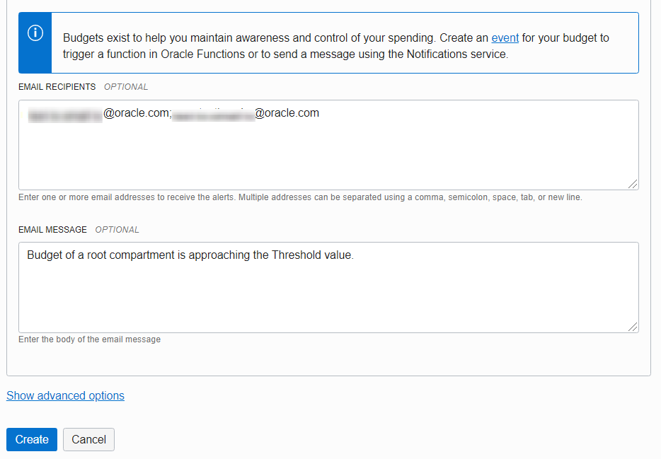

# Budget Creation

##Create a Budget

## 1.Navigate Budget
Open the navigation menu. Under Governance and Administration, go to Account Management and click Budgets.

 

## 2.Create budgets
Click Create Budget at the top of the budgets list. The Create Budget dialog is displayed.

  

## 3.Select the target for your budget
Select either Compartment or Cost-Tracking Tag to select the type of target for your budget.
Here in this lab we used Compartment as a target

For budgets targeting a compartment:
Select a target compartment for your budget from the Target Compartment drop-down list. Note that while the budget tracks spending in the specified target compartment, but you need to have permissions to manage budgets in the root compartment of the tenancy to create and use budgets.

## 4.Enter budget name
Enter a name for your budget in the Name text field.

## 5.Set monthly amount for you budget
Enter a monthly amount for your budget in the Monthly Budget Amount field. The minimum allowed value for your monthly budget is   1; the maximum allowed value is 999,999,999,999.

  
  
  

## 6. After creation a budget for a compartment
  
  

  You may proceed to the next lab.

## Learn More

* [Budget](https://docs.cloud.oracle.com/en-us/iaas/Content/Billing/Concepts/budgetsoverview.htm)

## Acknowledgements
- **Authors/Contributors** - Harshit Kumar, Constantin Sebe
* **Last Updated By/Date** - Harshit Kumar, August 2020 <Name, Group, Month Year>

## See an issue?
Please submit feedback using this [form](https://apexapps.oracle.com/pls/apex/f?p=133:1:::::P1_FEEDBACK:1). Please include the *workshop name*, *lab* and *step* in your request.  If you don't see the workshop name listed, please enter it manually. If you would like for us to follow up with you, enter your email in the *Feedback Comments* section.
