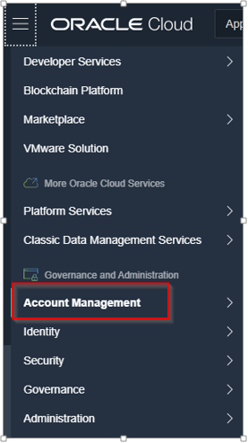
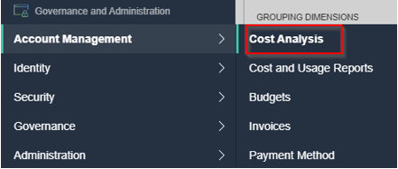
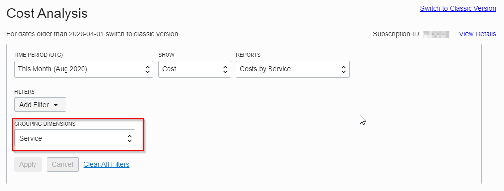
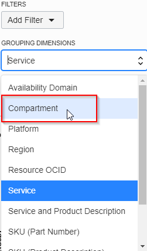
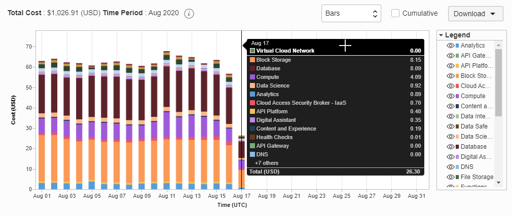

# Cost Analysis

## 1.Cost and Usage Reports Analysis
A cost report is a comma-separated value (CSV) file that is similar to a usage report, but also includes cost columns. The report can be used to obtain a breakdown of your invoice line items at resource-level granularity. As a result, you can optimize your Oracle Cloud Infrastructure spending, and make more informed cloud spending decisions.
A usage report is a comma-separated value (CSV) file that can be used to get a detailed breakdown of resources in Oracle Cloud Infrastructure for audit or invoice reconciliation.

## 2.Select Cost Analysis

Under Top Left “Hamburger Menu” we can select from the Governance and Administration Tab.
The Account Management Tab which opens up the Cost Analysis Options

  

  

## 3.Cost Analysis Options

Under this view, there is the possibility to create specific filters from different time periods, reports
And also grouping dimensions, with different values, for example Availability Domain, Compartment, Service, etc

## 4.Overview of the Cost Analysis Diagram

Below we would be able to see a detailed overview of the Cost Analysis Diagram:
    

You may proceed to the next lab.

## Learn More

* [Budget](https://docs.cloud.oracle.com/en-us/iaas/Content/Billing/Concepts/budgetsoverview.htm)
* [Cost Analysis](https://docs.cloud.oracle.com/en-us/iaas/Content/Billing/Concepts/costanalysisoverview.htm)

## Acknowledgements
- **Authors/Contributors** - Harshit Kumar, Constantin Sebe
* **Last Updated By/Date** - Harshit Kumar, August 2020 <Name, Group, Month Year>

## See an issue?
Please submit feedback using this [form](https://apexapps.oracle.com/pls/apex/f?p=133:1:::::P1_FEEDBACK:1). Please include the *workshop name*, *lab* and *step* in your request.  If you don't see the workshop name listed, please enter it manually. If you would like for us to follow up with you, enter your email in the *Feedback Comments* section.
